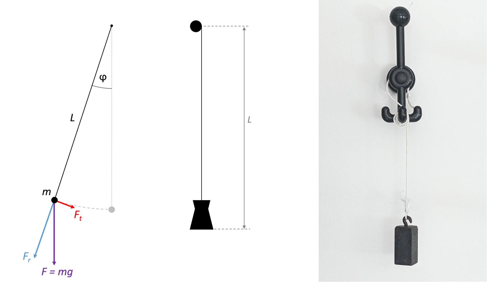
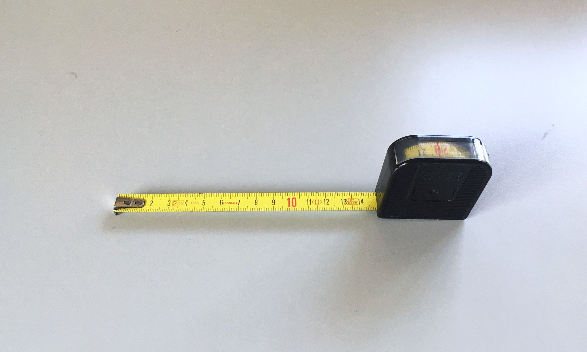
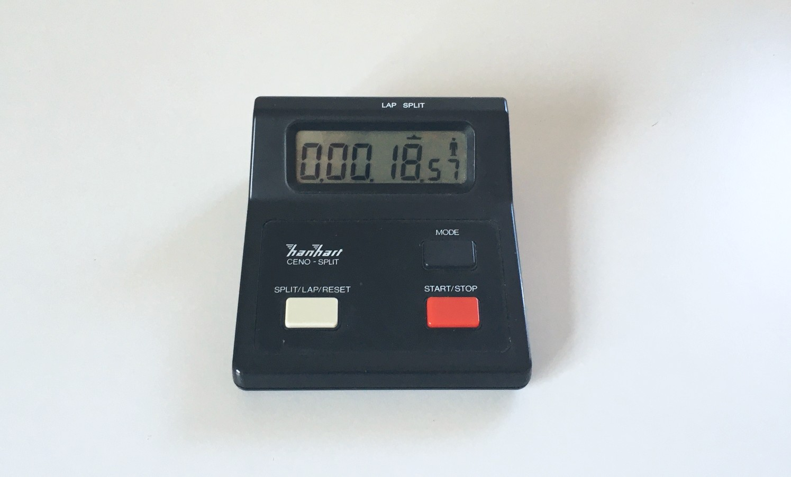

# 🪧 Versuch 2: 
## Bestimmung der Erdbeschleunigung mit dem Fadenpendel

In diesem Versuch wird die **Erdbeschleunigung *g*** mit Hilfe eines **einfachen Fadenpendels** bestimmt.  
Der inhaltliche Schwerpunkt liegt auf der **korrekten Auswertung der Messwerte**, der **Bestimmung der Unsicherheiten** und der **Diskussion der Ergebnisse**.

---

## 🔬 Versuchsaufbau

Zur experimentellen Realisierung eines **mathematischen Pendels** verwenden wir ein **einfaches Fadenpendel**.

Da die **Masse nicht punktförmig** und der **Faden nicht masselos** ist, treten Abweichungen vom idealen Modell auf.  
Zusätzlich beeinflussen **Reibung** und **Luftwiderstand** die Schwingungsdauer durch eine allmähliche Abnahme der Amplitude.

---

### 📏 Bestimmung der Pendellänge *L*

Da das Gewicht nicht punktförmig ist, muss festgelegt werden, wie die Länge *L* zu verstehen ist:  
Wir messen stets **vom Mittelpunkt der Aufhängung bis zum untersten Punkt des Gewichts**.

Die Länge *L* wird mit einem **Maßband** gemessen.

---

### ⏱️ Messung der Schwingungsdauer *T*

Die **Schwingungsdauer *T*** wird mit einer **digitalen Stoppuhr** bestimmt.

---

💡 *Hinweis:* Achte auf eine ausreichend große Schwingungsdauer (mehrere Perioden mitteln) und auf kleine Amplituden, damit die Näherung des mathematischen Pendels gültig bleibt.
