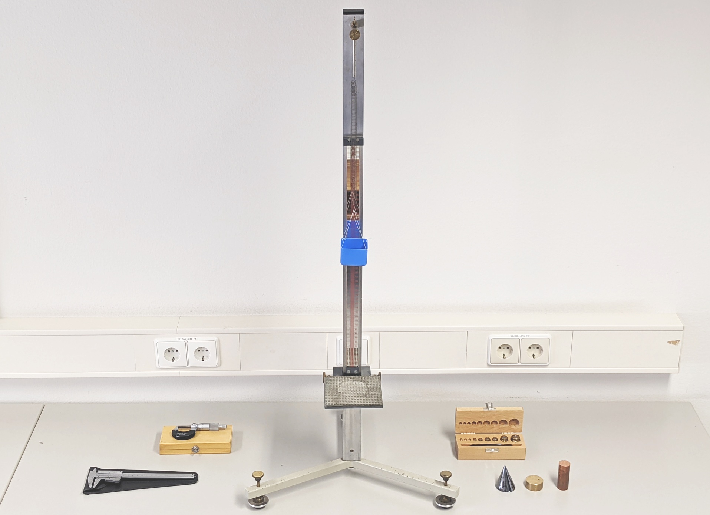
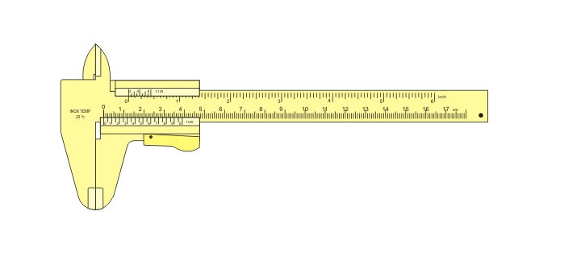

# 🧪 Versuch 4  
## Bestimmung der Dichte verschiedener Metalle

Wir bestimmen die **Dichte** als Verhältnis von **Masse zu Volumen** für verschiedene Metalle.

Die **Masse** wird mit einer **selbst kalibrierten Federwaage** gemessen,  
das **Volumen** für regulär geformte Körper aus **Längenmessungen** berechnet.

---

## 🎬 Motivationsvideo

(Die in den Videos behandelten Experimente entsprechen nicht unbedingt den Aufgaben in der Versuchsanleitung.)

```{youtube} B4CvOtUG-20
:width: 100%
:height: 450
```

---

## 🔬 Versuchsaufbau



Versuchsaufbau mit Messschieber, Bügelmessschraube, Federwaage, Prüfgewichten und verschiedenen Metallproben.

---

## 📏 Messschieber


