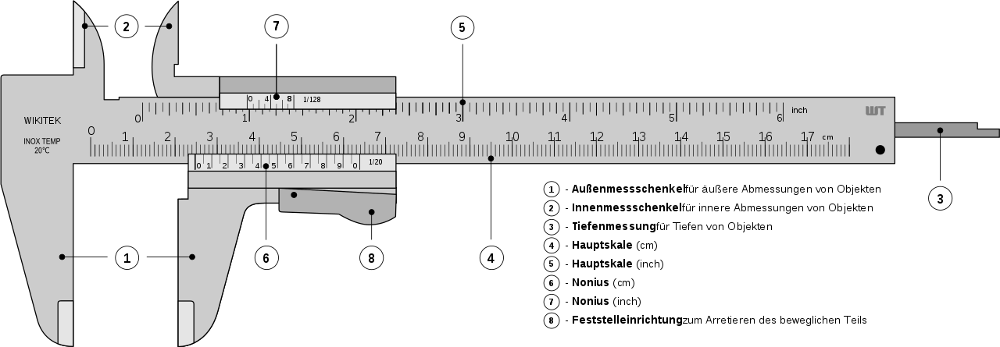
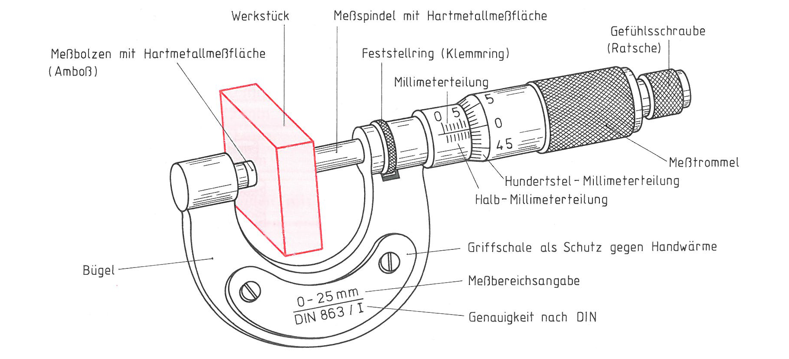
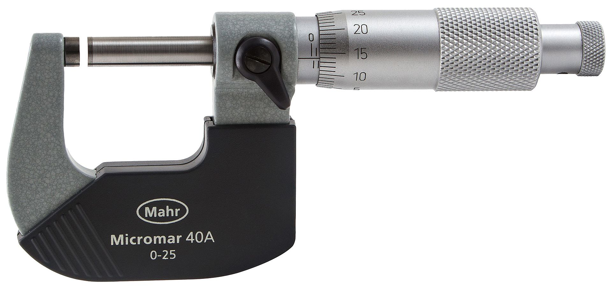
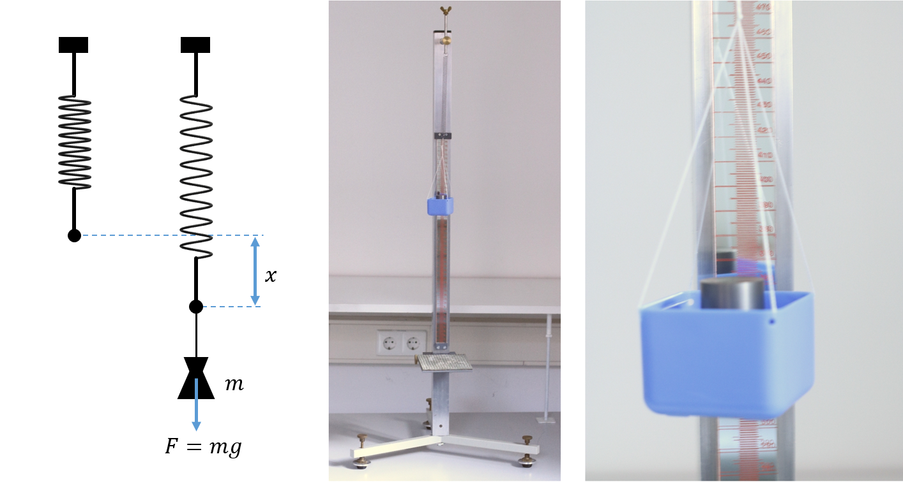
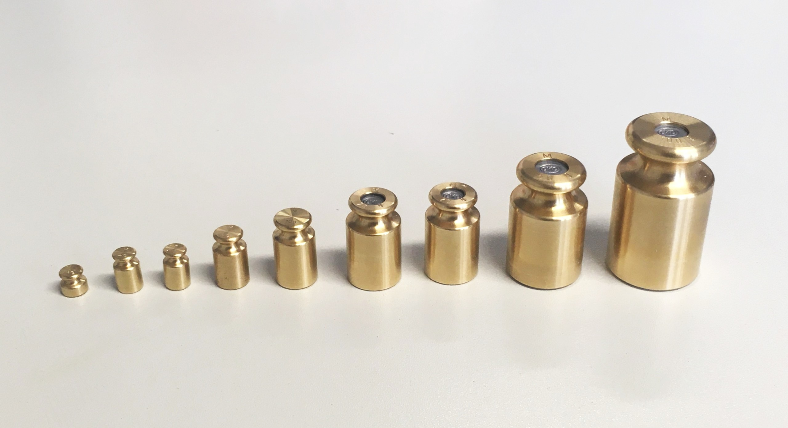
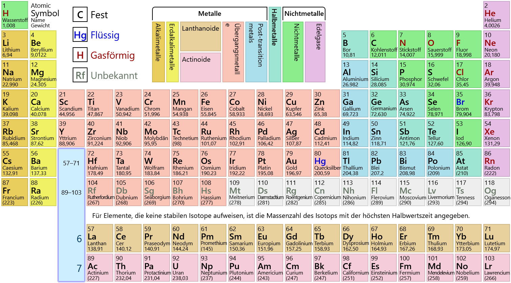
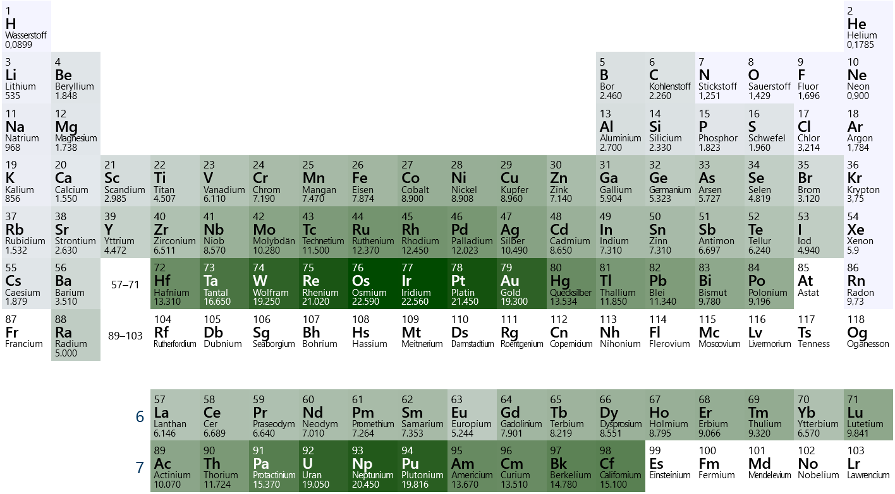

# 🧪 Versuch 4  
## Bestimmung der Dichte verschiedener Metalle

Wir bestimmen die **Dichte** als Verhältnis von **Masse zu Volumen** für verschiedene Metalle.

Die **Masse** wird mit einer **selbst kalibrierten Federwaage** gemessen,  
das **Volumen** für regulär geformte Körper aus **Längenmessungen** berechnet.

---

## 🎬 Motivationsvideo

(Die in den Videos behandelten Experimente entsprechen nicht unbedingt den Aufgaben in der Versuchsanleitung.)

```{youtube} B4CvOtUG-20
:width: 100%
:height: 450
```

---

## 🔬 Versuchsaufbau


Versuchsaufbau mit Messschieber, Bügelmessschraube, Federwaage, Prüfgewichten und verschiedenen Metallproben.

---

## 📏 Messschieber



**Abbildung:** Ein Messschieber besitzt einen festen und einen beweglichen Messschenkel, die an die Probe angelegt werden, ohne Druck auszuüben. Er eignet sich für Außen-, Innen- und Tiefenmaße.


**Abbildung:** Die Längenmessung erfolgt durch Vergleich mit einer kalibrierten Skala. Ein Nonius verbessert die Ablesegenauigkeit.

🔗 [Wikipedia – Messschieber](https://de.wikipedia.org/wiki/Messschieber)  
🔗 [Wikipedia – Nonius](https://de.wikipedia.org/wiki/Nonius)

---

## ⚙️ Messschraube



**Abbildung:** Eine Messschraube (Bügelmessschraube, Mikrometerschraube) besitzt eine feste und eine bewegliche Messfläche, verbunden durch einen Bügel. Die Bewegung erfolgt über eine Feingewindeschraube, die mit einer Gefühlsschraube betätigt wird.



**Abbildung:** Der Messwert wird zunächst auf der Hauptskala, anschließend (Bruchteile von 1/50 oder 1/100 mm) auf der Feinskala abgelesen. Im Beispiel beträgt der Messwert 1,64 mm.
 
🔗 [Wikipedia – Messschraube](https://de.wikipedia.org/wiki/Messschraube)

---

## ⚖️ Federwaage



**Abbildung:** Die Federwaage beruht auf der Ausdehnung einer Spiralfeder durch die Gewichtskraft. Es gilt näherungsweise das Hookesche Gesetz mit linearer Beziehung zwischen Ausdehnung und Gewichtskraft. Eine Spiegelskala ermöglicht parallaxenfreies Ablesen.

---

## 🧱 Prüfgewichte



**Abbildung:** Zur Kalibrierung der Federwaage werden Prüfgewichte bekannter Masse verwendet. Diese existieren in den Genauigkeitsklassen E1, E2, F1, F2, M1, M2, M3 (abnehmende Genauigkeit).

📄 [Kern Prüfgewichte (PDF)](./PDFs/Kern_Pruefgewichte.pdf)  
📄 [Kalibrierschein (PDF)](./PDFs/Kalibrierschein.pdf)

---

## 🧪 Periodensystem und Dichte



**Abbildung:** Im Periodensystem sind alle chemischen Elemente nach Ordnungszahl angeordnet; Elemente mit ähnlichen chemischen Eigenschaften stehen in Spalten (Gruppen).



**Abbildung:** Die Dichte der Elemente steigt tendenziell mit der Ordnungszahl. Alkali- und Erdalkalimetalle haben niedrige Dichten, Übergangsmetalle, Lanthanoide und Actinoide vergleichsweise hohe.

🔗 [Ptable.com – Interaktives Periodensystem](https://ptable.com/)
